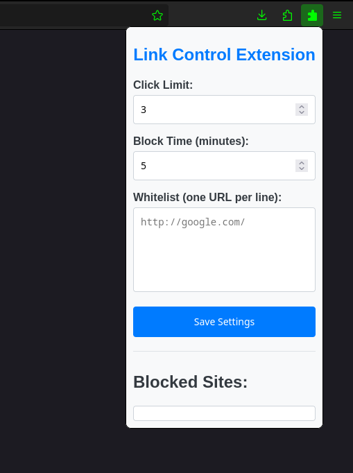

# LinkBlocker - Extensão Firefox

**LinkBlocker** é uma extensão para Firefox que ajuda a controlar o consumo de links em sites, evitando o fenômeno que chamei de _DoomLinking_ (baseado no _DoomScrolling_). A extensão bloqueia a aba automaticamente após atingir um limite configurável de links abertos, ajudando a manter foco e reduzir sobrecarga de informação.

  

## Funcionalidades

- Bloqueio automático da aba após abrir uma quantidade definida de links.
- Personalização do limite de links.
- Tempo de desbloqueio configurável para retomar o uso da aba.
- Interface simples e prática diretamente no navegador.
- Ajuda a controlar hábitos de navegação e aumentar produtividade.

## Como usar

1. Abra qualquer site.
2. Clique no ícone do **LinkBlocker** na barra do navegador.
3. Defina o limite de links e o tempo de bloqueio.
4. Navegue normalmente; ao atingir o limite, a aba será bloqueada automaticamente.
5. Após o tempo configurado, a aba é desbloqueada para uso.

## Observações

- Funciona em qualquer site no Firefox.
- Ideal para quem deseja reduzir hábitos de navegação compulsiva e manter foco.
- Personalize limites para cada site individualmente.

## Tecnologias

- JavaScript
- HTML
- CSS
- API de Extensões do Firefox
